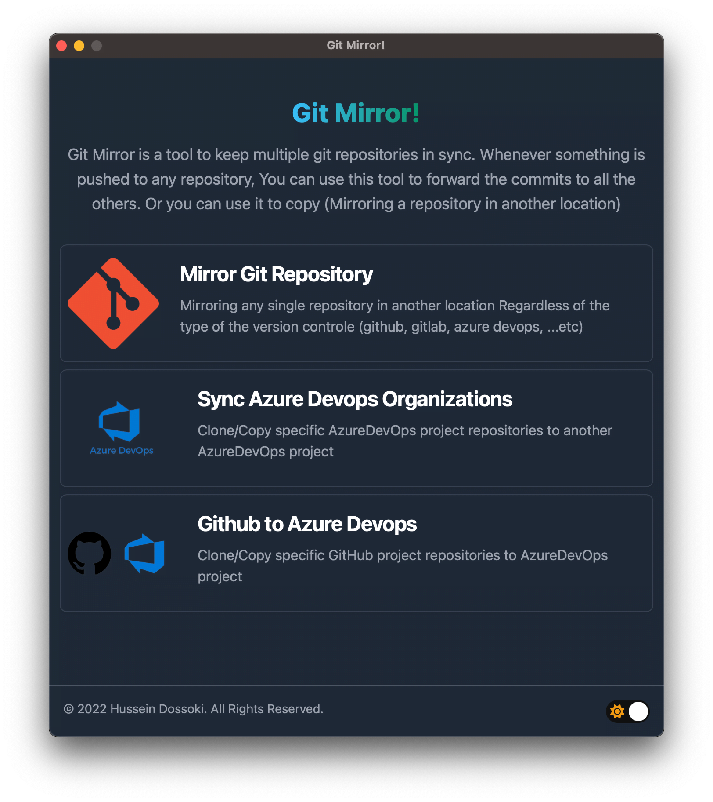
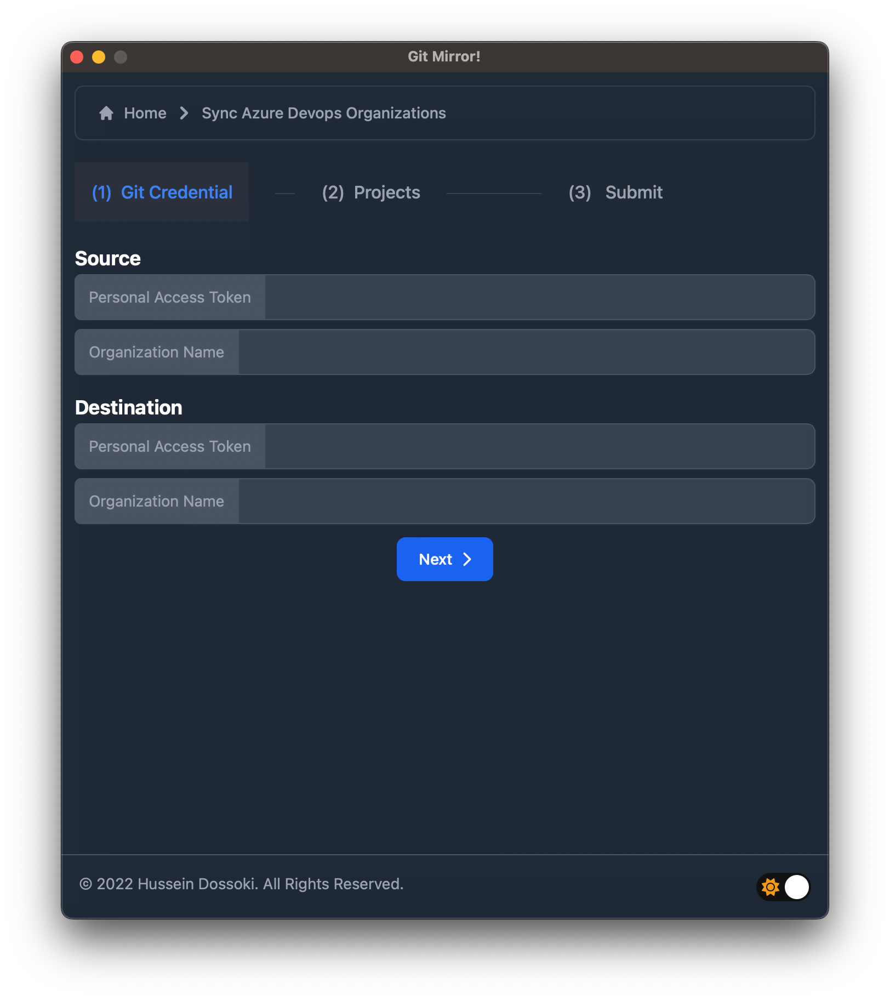
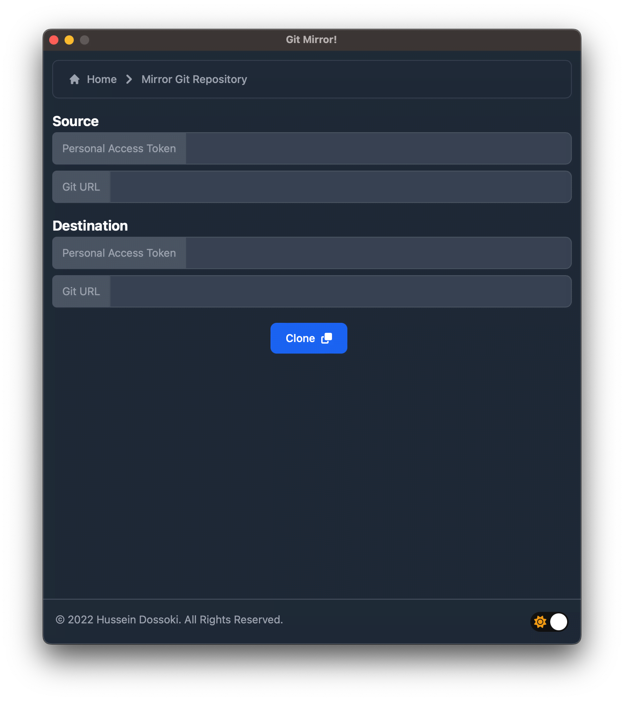

<p align="center">
  
</p>

# Git Mirror  [](https://github.com/HusseinDossoki/git-mirror/blob/dev/LICENSE)


*Git Mirror* is a tool to keep multiple git repositories in sync. Whenever something is pushed to any repository, You can use this tool to forward the commits to all the others. Or you can use it to copy (Mirroring a repository in another location)

<div align="center">


<br/>*App Demo*

</div>

## Screenshots


## Features
##### 1) Copy Single Repository ✅
Mirroring any single repository in another location Regardless of the type of version control (github, gitlab, bitbucket, azure devops, ...etc)
##### 2) Azure to Azure ✅
Sync two different Azure DevOps organizations (Projects, Repositories, Branches, and Commits)
##### 3) GitHub to Azure 🚫
Sync Github project with Azure DevOps project (Repositories, Branches, and Commits)

## Libraries Used

#### Frontend

* [Vue3](https://vuejs.org/) - See [`source code`](./src)
* [Tailwind CSS](https://flowbite.com/docs/getting-started/introduction/) - frontend toolkit

#### Backend

* [Rust](https://www.rust-lang.org/) and [Tauri](https://tauri.app/) framework - See [`source code`](./src-tauri)
* [reqwest](https://docs.rs/reqwest/latest/reqwest/) - The reqwest crate provides a convenient, higher-level HTTP Client.


## Set up your dev environment
1) Download and Install [Visual Studio Code](https://code.visualstudio.com/)
1) Download and Install [Rust](https://www.rust-lang.org/tools/install)
1) Download and Install [Node Js](https://nodejs.org/en/download/)

## Development

1) Clone the Git repository

```sh
git clone https://github.com/HusseinDossoki/git-mirror
```

2) CD into the folder

```sh
cd git-mirror
```

3) Install node dependencies 

```sh
npm install
```

4) Start the tauri dev server

```sh
npm tauri run dev
```
